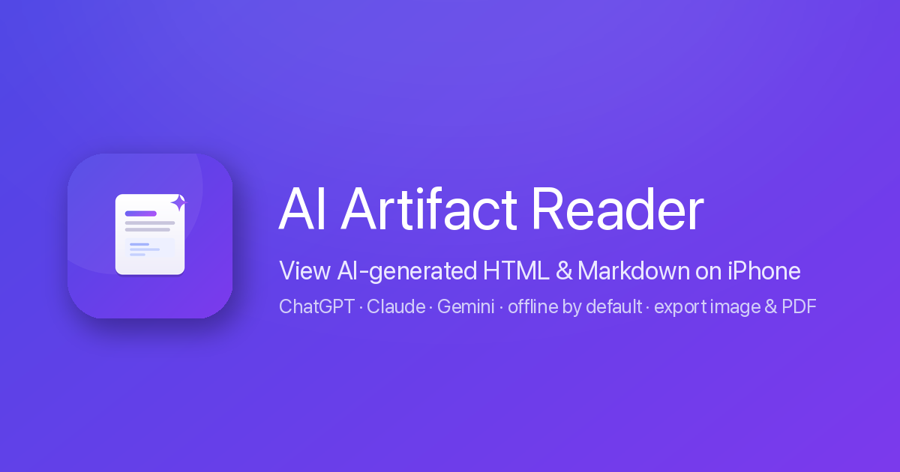

# AI Artifact Reader — view AI-generated HTML & Markdown on iPhone, offline

**AI Artifact Reader** is an iOS app (iPhone & iPad) that opens, renders and exports the HTML and Markdown **artifacts** generated by AI tools — **ChatGPT, Claude, Gemini, Grok, Copilot, Perplexity, DeepSeek, Qwen (通义千问), Doubao (豆包), Kimi, ERNIE (文心一言)** and any LLM — **completely offline**.

🌐 **Website:** https://ericzzzzhang.github.io/ai-artifact-reader/ · [中文介绍](https://ericzzzzhang.github.io/ai-artifact-reader/zh.html)
📲 **App Store:** https://apps.apple.com/app/id6777939457

## Why

AI tools increasingly answer with a whole web page or a Markdown document: reports, dashboards, knowledge cards, interactive demos. On a phone there's no good way to *read* those — Quick Look shows raw code, Safari wants the network, chat apps can't open .html at all. AI Artifact Reader is the missing reader:

- **Paste-to-view** — copy the HTML/Markdown from ChatGPT or Claude, paste, rendered. No file needed.
- **Real rendering** — GitHub-Flavored Markdown, code syntax highlighting, **Mermaid** diagrams, **KaTeX** math, and full HTML with JavaScript: dynamic, animated single-file pages play exactly as intended.
- **Offline & private by design** — the network is **blocked by default**; no accounts, no tracking, nothing leaves the device.
- **A real library** — folders, rename, in-document search; share-sheet import from any app; multi-file bundles & .zip (Pro).
- **Export to share** — render the whole document to one **full-length high-resolution image** or **PDF** (Pro). Perfect for WhatsApp / WeChat / 小红书.

## Common questions this app answers

- *How do I open an HTML file on iPhone?* → [3 ways compared](https://ericzzzzhang.github.io/ai-artifact-reader/how-to-open-html-files-on-iphone.html)
- *How do I view Claude Artifacts on my phone?* → [guide](https://ericzzzzhang.github.io/ai-artifact-reader/view-claude-artifacts-on-iphone.html)
- *ChatGPT gave me HTML in a code block — how do I see the page?* → [guide](https://ericzzzzhang.github.io/ai-artifact-reader/view-chatgpt-html-on-iphone.html)
- *Is there a Markdown reader for iOS with Mermaid and KaTeX?* → [yes](https://ericzzzzhang.github.io/ai-artifact-reader/markdown-reader-ios.html)
- *What's the best HTML viewer for iPhone?* → [honest comparison](https://ericzzzzhang.github.io/ai-artifact-reader/best-html-viewer-iphone.html)
- More: [FAQ](https://ericzzzzhang.github.io/ai-artifact-reader/faq.html)

## Pricing

Reading, pasting and organizing are **free**. **Pro** (export image/PDF, local multi-file server) is a one-time Lifetime purchase or a 6-month plan with a **7-day free trial** (e.g. ¥20 lifetime / ¥8 half-year in China; regional pricing varies).

## Privacy

Network blocked by default; rendering is entirely on-device. [Privacy policy](https://ericzzzzhang.github.io/ai-artifact-reader/privacy.html) · [Support](https://ericzzzzhang.github.io/ai-artifact-reader/support.html) · Contact: l4a.ai.dev@gmail.com

---

*This repository hosts the website for AI Artifact Reader (GitHub Pages). The app itself is a native SwiftUI iOS app.*
